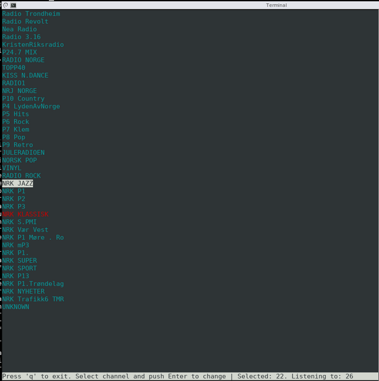

gr-dab
======

```
 gr-dab - GNU Radio Digital Audio Broadcasting module
 Copyright (C) Andreas Müller, 2011, Moritz Luca Schmid, 2017

 This program is free software: you can redistribute it and/or modify
 it under the terms of the GNU General Public License as published by
 the Free Software Foundation, either version 3 of the License, or
 (at your option) any later version.

 This program is distributed in the hope that it will be useful,
 but WITHOUT ANY WARRANTY; without even the implied warranty of
 MERCHANTABILITY or FITNESS FOR A PARTICULAR PURPOSE.  See the
 GNU General Public License for more details.

 You should have received a copy of the GNU General Public License
 along with this program.  If not, see <http://www.gnu.org/licenses/>.
```


This directory (and the resulting tarball) contains a build tree for
gr-dab.

gr-dab contains everything needed to get audio from DAB and DAB+

Much of the code was developed as part of "Google Summer of Code 2017" by
Moritz Luca Schmid. (the completion of audio reception of DAB and DAB+).
His fork can be found here: https://github.com/kit-cel/gr-dab The fork also
contains everything needed for transmission of DAB radio. It does however have
a number of external dependencies which makes it slightly more tricky to
install than this version without TX.

This package requires that gnuradio-core is already installed.  It
also depends on some GNU Radio prerequisites, such as Boost and
cppunit. Additionally it depends on the FAAD2 library. (ubuntu: sudo apt-get
install libfaad-dev, fedora: sudo dnf install faad2-devel)

To build gr-dab, run these commands:

```
  $ mkdir build
  $ cd build
  $ cmake ../
  $ make
  $ sudo make install
  $ sudo ldconfig
```

GNU Radio Companion
-------------------

After having installed gr-dab, you can play around with GNU radio blocks for gr-dab in GNU Radio Companion, or you can use the tool *grdab* to start receiving DAB+ audio using a software defined radio (SDR).


User guide for the utility **grdab**
------------------------------------

All SDRs supported by gr-osmosdr and which can tune to the DAB frequencies can be used with grdab. It has been verified to work with RTL-SDR, HackRF and USRP B200. grdab can currently only receive DAB+ audio.


#### "Calibration":

When connecting a new radio, run:

```
grdab adjust
```

This will bring up a GUI where you will see the frequency spectrum and the constellation diagram.

1. Drag the channel selector to a valid DAB+ frequency in your area.
2. Adjust the gain sliders such that frequency spectrum looks good. It should be an almost square looking wide signal.
3. Adjust the ppm slider until the constellation diagram consists of 4 quite confined dots.
4. Then click 'save configuration'
5. Your SDR is now *calibrated* and can be used to receive DAB+ audio.

The calibration data is stored in the file ~/.grdab/adjustment.yaml. Whenever connecting a new SDR, you will have to repeat the adjustment procedure above.

#### Check available channels:

To see what channels are available on a chosen frequency, run:

```
grdab info -f <frequency_in_mhz>
```

#### Listen to DAB+:

When you find a channel, you can start receiving audio with:

```
grdab receive -f 227.360 --bit_rate 80 --address 204 --subch_size 60 --protect_level 2 --audiorate 48000
```

where you replace the different options with the output from *grdab info* for the desired channel. You might have to experiment with a few different values for *--audiorate* (such as 44100 or 48000).

#### Ncurses app:


If you create a file called ~/.grdab/channels.yaml, and list all the channels in your area:

```
- {name: NRK P1          , frequency: 227.360, address: 204, subch_size:  60, protect_level: 2, bit_rate:  80}
- {name: NRK P2          , frequency: 227.360, address: 384, subch_size:  60, protect_level: 2, bit_rate:  80}
- {name: NRK P3          , frequency: 227.360, address: 444, subch_size:  60, protect_level: 2, bit_rate:  80}
- {name: NRK KLASSISK    , frequency: 227.360, address: 564, subch_size:  60, protect_level: 2, bit_rate:  80}
- ...
```

You can afterward use the grdab ncurses application:
```
grdab curses
```

It allows you to select a channel and listen to it:




#### ZMQ source:

To allow starting and stopping grdab without having to reinitialize the Software Defined Radio, you can start apps/sdr-zmq-daemon in the background. If you then start grdab with `grdab -z`, it will start much faster, and you can have multiple instances of grdab running at the same time.
